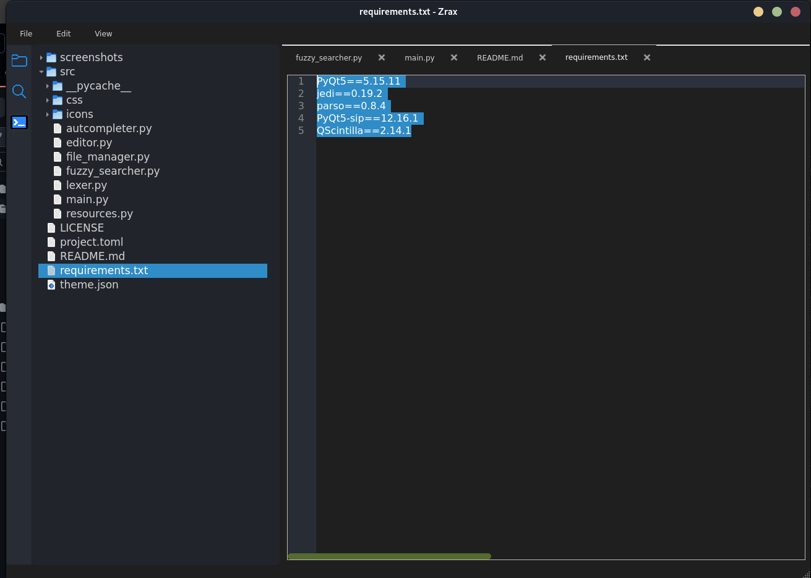

# **Zrax**
## A Python Code Editor

A lightweight and customizable Python-based code editor with syntax highlighting, autocompletion, and fuzzy searching.

## Features

- **Syntax Highlighting:** Supports multiple languages with a custom lexer.
- **Autocomplete:** Intelligent code suggestions for faster development.
- **Fuzzy Search:** Quickly find files and functions.
- **Custom Themes:** Modify the editor's appearance using `theme.json` and `style.qss`.
- **File Manager:** Open, save, and manage files within the editor.
- **Lightweight & Fast:** Built with PyQt for a smooth user experience.

## Screenshots





<br>
<br>

## Installation
### Clone the Repository
```bash
git clone https://github.com/yourusername/Code_editor.git
cd Code_editor
```


### Create & Activate Virtual Environment
```bash
python -m venv myenv
source myenv/bin/activate # On Mac/Linux
myenv\Scripts\activate # On Windows
```
### Install Dependencies

```bash
pip install -r requirements.txt

```
###For Running the Project
```python
python -u "src/main.py"
```
## Project Structure

# Code Editor Project Structure

- **Code_editor/**
  - **screenshots/**  _# UI preview images_
  - **src/**  _# Source code_
    - **css/**  _# Stylesheets_
    - **icons/**  _# Icons and resources_
    - **autocompleter.py**  _# Code autocompletion logic_
    - **editor.py**  _# Core editor functionality_
    - **file_manager.py**  _# Handles file operations_
    - **fuzzy_searcher.py**  _# Fuzzy search implementation_
    - **lexer.py**  _# Syntax highlighting_
    - **main.py**  _# Entry point_
  - **.gitignore**  _# Git ignore file_
  - **LICENSE**  _# License information_
  - **README.md**  _# Documentation_
  - **requirements.txt**  _# Dependencies_
  - **theme.json**  _# Custom themes_


## Contributing

1.  Fork the repository.
2.  Create a new branch (`feature-xyz`).
3.  Commit your changes and push.
4.  Create a pull request!

## License

This project is licensed under the MIT License.
